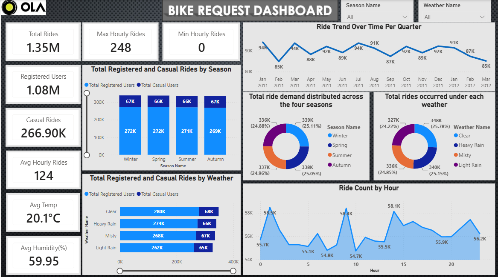

** OLA bike Ride Demand & Customer Analytics **

Analysis of bike ride-sharing demand patterns to uncover customer, temporal, and weather-driven trends that support business and capacity planning decisions.

Problem / Objective

Ride-sharing platforms need to understand when, who, and under what conditions rides are booked in order to plan driver capacity, target retention efforts, and anticipate demand shifts. This project analyzes historical ride data to answer:

-What share of rides come from registered vs. one-time customers?
-When do peak demand hours occur, and how much volume do they carry?
-How does weather affect ride volume?

Data: 
10,886 ride records, representing 1.35M+ total rides
Fields include: customer type (registered/casual), ride timestamp, weather condition, and ride volume

Tools & Approach:
Python & SQL — data cleaning, aggregation, and pattern analysis across customer segments and time periods
Power BI, Power Query, DAX — built an interactive dashboard to visualize demand trends
MS Excel — supporting data validation and quick checks

Workflow: raw ride data → cleaned and structured in SQL/Python → modeled and visualized in Power BI → key patterns surfaced for business interpretation.

Key Findings: Insight	Result
-Registered customer share	80.24% of total rides
-Peak-hour concentration	Top 3 peak hours drove ~13% of total ride volume
-Weather impact	Clear-weather days: 348K rides vs. light-rain days: 327K rides (~6.4% difference)

Business takeaway: 
Registered riders are the core revenue driver, suggesting retention programs would have outsized impact. Peak-hour concentration and weather sensitivity both point to opportunities for dynamic driver allocation and demand forecasting.

